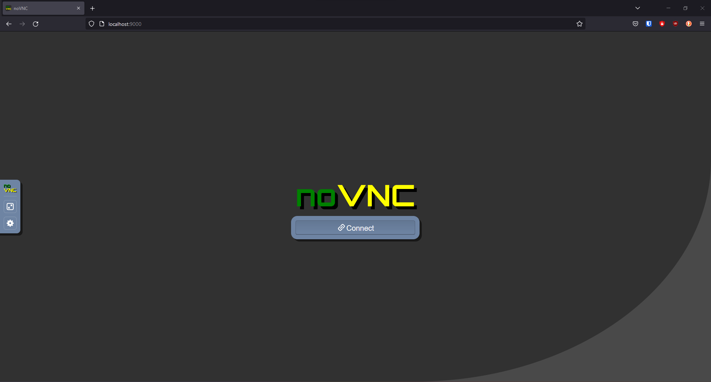
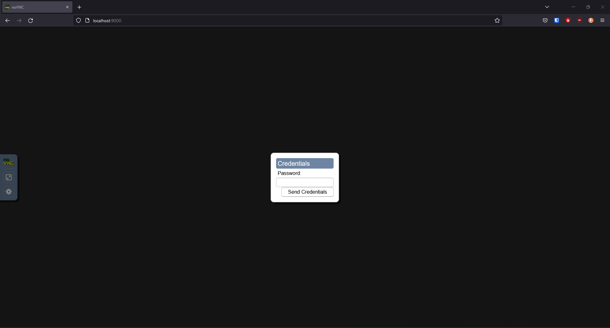
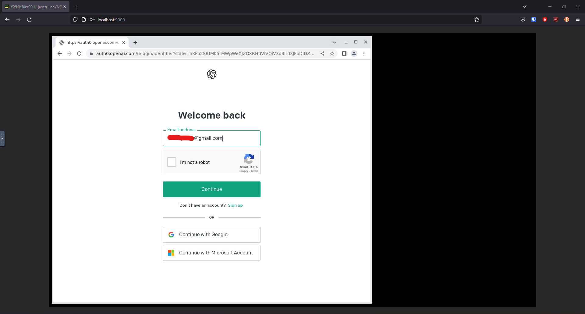
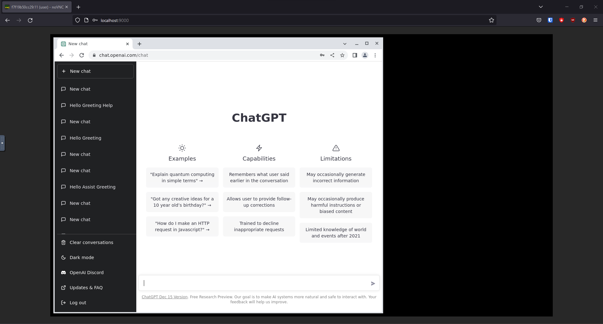
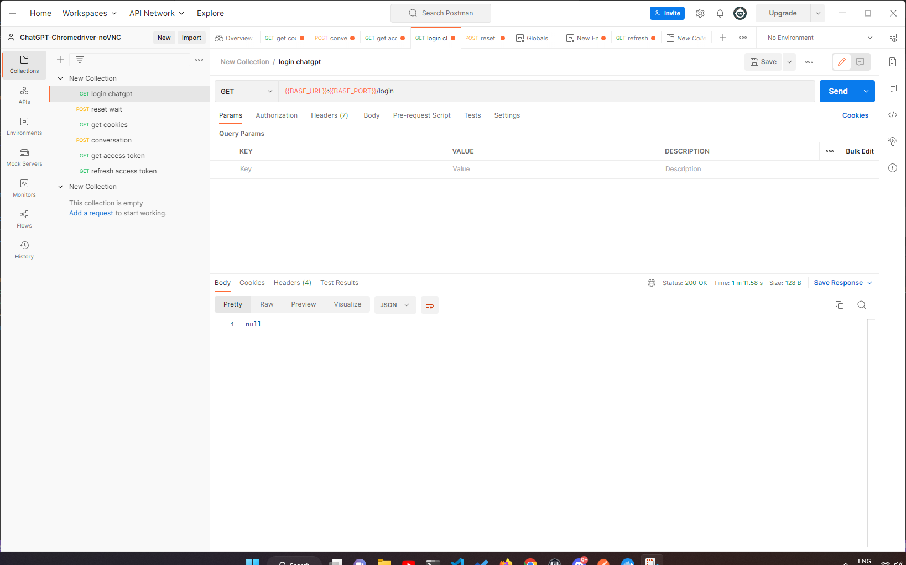

## ChatGPT + noVNC + Docker

You must have docker or podman to be able to run this repo.

There is a docker-compose file that will build a docker image with all the dependencies and run it.

_*(Optional)*_ There is also a postman collection that you can use to test the API.

Create a `.env` file with the following content:

```bash
touch .env
echo "VNC_GEOMETRY=1600x900" > .env
echo "VNC_PASSWD=<your vnc password>" >> .env
echo "USER_PASSWD=<container's user password>" >> .env
echo "EMAIL=<your openai account email>" >> .env
echo "PASSWORD=<your openai account password>" >> .env
```

## How to run

```bash
docker compose up --build
```

Port 8080 is exposed for fastapi server
Port 9000 is exposed for noVNC

http://localhost:9000 allows you to connect to docker container via graphical interface.

For some reason sometimes the noVNC UI does not load properly, if that happens try with other browsers.










## How to use

_**(Optional)**_ Open postman and import the collection from `postman_collection.json`


You can also use `http://localhost:8080/docs` to test the API

Make a request to `http://localhost:8080/login`, it will open a browser window to login to openai.

Wait until it enters the email (it will wait for you to solve the captcha if there is one)

Head to the browser window in the noVNC (`http://localhost:9000`) and solve the captcha.

After you solve the captcha make a request to `http://localhost:8080/reset-wait` to continue the login process.

After you login you can make a request to `http://localhost:8080/cookies` and `http://localhost:8080/access-token` to make sure you are logged in.

Now you can make a request to `http://localhost:8080/backend-api/conversation` with the same payload you would  make to openai's api.

```json
{
    "action": "next",
    "messages": [
        {
            "id": "asdasd1-1231sdad-121",
            "role": "user",
            "content": {
                "content_type": "text",
                "parts": [
                    "Hello, Assistant!",
                ],
            },
        },
    ],
    "parent_message_id": "1sasd3-asc24-asse234",
    "model": "text-davinci-002-render",
}
```

Response will be as follows:

```json
{
    "status": "",
    "error": [],
    "data": {
        "message": {
            "id": "51d335cd-3d33-4f0f-bfa1-2f2be6256713", 
            "role": "assistant", 
            "user": null, 
            "create_time": null, 
            "update_time": null, 
            "content": {
                "content_type": "text", 
                "parts": [
                    "ChatGPT's response"
                ]
            }, 
            "end_turn": null, 
            "weight": 1.0, 
            "metadata": {}, 
            "recipient": "all"
        }, 
        "conversation_id": "b15d6133-d792-4568-9f8e-71bee1782e28", 
        "error": null
    }
}
```

### _*Note:*_ 
It does not stream the response, it waits until the response is ready and then returns it since we are using tls-client instead of httpx or requests becuse of the tls fingerprinting issue with other http clients.
